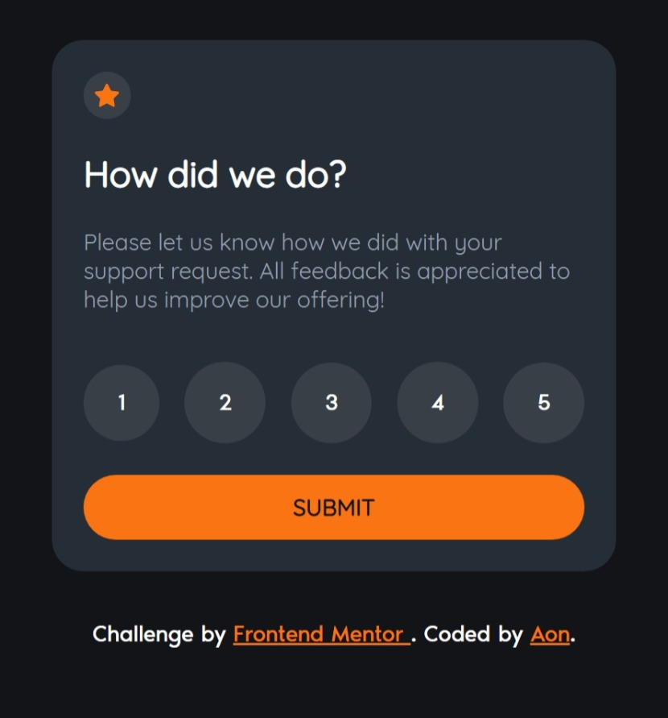
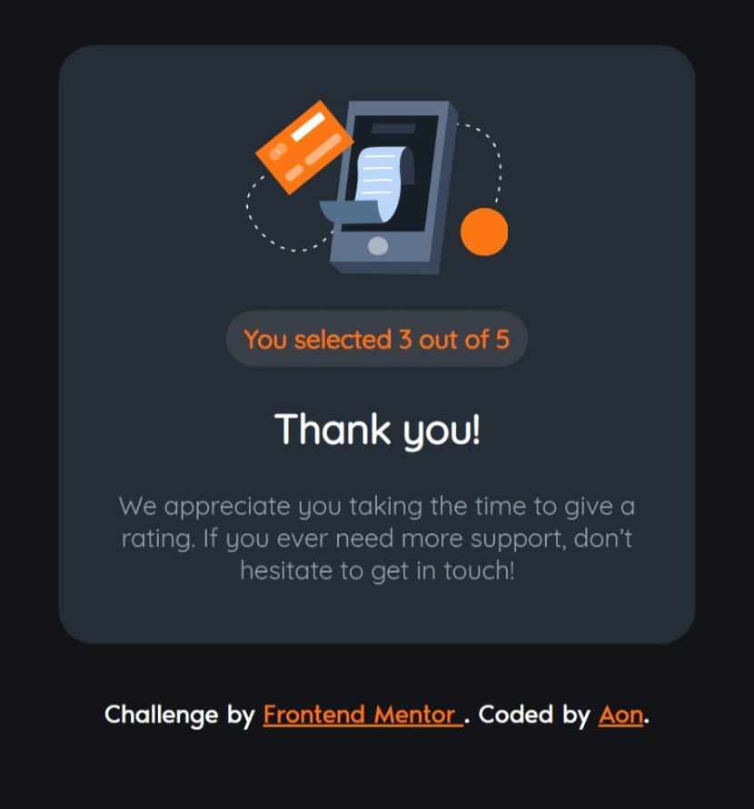

# Frontend Mentor - Interactive rating component solution

This is a solution to the [Interactive rating component challenge on Frontend Mentor](https://www.frontendmentor.io/challenges/interactive-rating-component-koxpeBUmI). Frontend Mentor challenges help you improve your coding skills by building realistic projects.

## Table of contents

- [Frontend Mentor - Interactive rating component solution](#frontend-mentor---interactive-rating-component-solution)
  - [Table of contents](#table-of-contents)
  - [Overview](#overview)
    - [The challenge](#the-challenge)
    - [Screenshot](#screenshot)
    - [Links](#links)
  - [My process](#my-process)
    - [Built with](#built-with)
    - [AI Collaboration](#ai-collaboration)
      - [What tools did I use?](#what-tools-did-i-use)
      - [How did I use them?](#how-did-i-use-them)
  - [Author](#author)

## Overview

### The challenge

Users should be able to:

- View the optimal layout for the app depending on their device's screen size
- See hover states for all interactive elements on the page
- Select and submit a number rating
- See the "Thank you" card state after submitting a rating

### Screenshot

  <figure style="margin:0; flex:1; text-align:center;">
    <figcaption>Preview</figcaption>
    
  </figure>

  <figure style="margin:0; flex:1; text-align:center;">
    <figcaption>Completed</figcaption>
    
  </figure>

### Links

- [Solution URL](https://github.com/Aon-m/interactive-rating-component-main/)
- [Live Server URL](https://aon-m.github.io/interactive-rating-component-main/)

## My process

### Built with

- Semantic HTML5 markup
- CSS custom properties
- Flexbox
- Mobile-first workflow
- SCSS
- Personal code snippets
- ES6 modules

### AI Collaboration

#### What tools did I use?

I used ChatGPT as my primary AI assistant

#### How did I use them?

- Debugging
- SEO, Accessibility, and Best Practices.
- Workflow Advice
- Code syntax

## Author

- Frontend Mentor - [@Aon](https://www.frontendmentor.io/profile/Aon-m)
- CSSBattle - [@Aon](https://cssbattle.dev/player/aon)
- Github - [@Aon-m](https://github.com/Aon-m)
